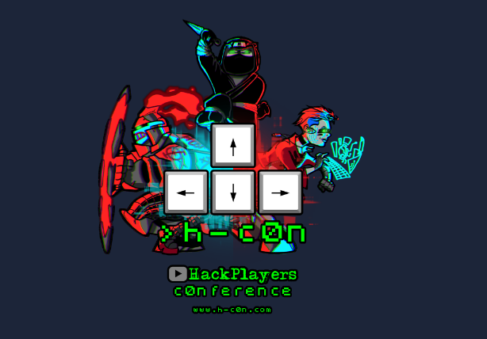
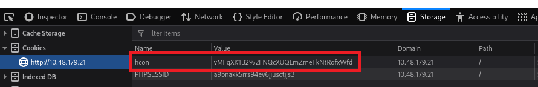

<html><head><meta http-equiv="Content-Type" content="text/html; charset=utf-8"/><title>hc0n Christmas CTF - Level hard</title></head><body><article id="30580a99-ddab-80bc-9272-fc6639b2f13a" class="page sans"><header><h1 class="page-title" dir="auto">hc0n Christmas CTF - Level hard</h1>

</header>

<figure id="30580a99-ddab-805e-9943-f9ebeb673f67" class="image"></figure>

Note : i will store the target ip address of the room as $domain 

<link rel="stylesheet" href="https://cdnjs.cloudflare.com/ajax/libs/prism/1.29.0/themes/prism.min.css" integrity="sha512-tN7Ec6zAFaVSG3TpNAKtk4DOHNpSwKHxxrsiw4GHKESGPs5njn/0sMCUMl2svV4wo4BK/rCP7juYz+zx+l6oeQ==" crossorigin="anonymous" referrerPolicy="no-referrer"/><pre id="30580a99-ddab-807d-97de-e38ccfb46558" class="code code-wrap"><code class="language-JavaScript" style="white-space:pre-wrap;word-break:break-all">  domain=$target_ip</code></pre>

Phase one : Scanning the running services using fast scanners first to see the potential open ports 

<ul id="30580a99-ddab-8058-b676-c6c4c58c0f51" class="bulleted-list"><li style="list-style-type:disc">personaly i like using Rustscan because it has Nmap database for service detection and OS Detection</li></ul>

<link rel="stylesheet" href="https://cdnjs.cloudflare.com/ajax/libs/prism/1.29.0/themes/prism.min.css" integrity="sha512-tN7Ec6zAFaVSG3TpNAKtk4DOHNpSwKHxxrsiw4GHKESGPs5njn/0sMCUMl2svV4wo4BK/rCP7juYz+zx+l6oeQ==" crossorigin="anonymous" referrerPolicy="no-referrer"/><pre id="30580a99-ddab-80fb-8d43-ce8452208bd5" class="code code-wrap"><code class="language-JavaScript" style="white-space:pre-wrap;word-break:break-all">rustscan -a $domain  --ulimit 5000 -- -sC -sV -T4</code></pre>

<ul id="30580a99-ddab-800c-aadb-d2a5c74fbef5" class="bulleted-list"><li style="list-style-type:disc">Note : you can use masscan as well for ultra fast scanning and then run Nmap scanning for service enumeration </li></ul>

Rustscan results were : 

<link rel="stylesheet" href="https://cdnjs.cloudflare.com/ajax/libs/prism/1.29.0/themes/prism.min.css" integrity="sha512-tN7Ec6zAFaVSG3TpNAKtk4DOHNpSwKHxxrsiw4GHKESGPs5njn/0sMCUMl2svV4wo4BK/rCP7juYz+zx+l6oeQ==" crossorigin="anonymous" referrerPolicy="no-referrer"/><pre id="30580a99-ddab-8057-ae67-c969ee921b59" class="code code-wrap"><code class="language-JavaScript" style="white-space:pre-wrap;word-break:break-all">PORT     STATE SERVICE    REASON         VERSION
22/tcp   open  ssh        syn-ack ttl 62 OpenSSH 7.2p2 Ubuntu 4ubuntu2.8 (Ubuntu Linux; protocol 2.0)
| ssh-hostkey:
|   2048 0b:e7:57:fa:16:73:ff:93:03:b8:f6:c5:c3:f3:16:07 (RSA)
| ssh-rsa AAAAB3NzaC1yc2EAAAADAQABAAABAQDl8Ks26llDVUI6WmMX4l2SH2Hz0lV7s7zHN7w2Fh4/7dAEN1IEn9/kstN9CbbzrLBIEESqh76Zc3kqku0qVv1bFBua8H99GPBs+JuKOJDPSfxqzZVCo29PD3IfXtjHZE7hDzK5O7Zgc/I1bmql1JbGOYEwCd6fkh2PC2wPLVShZCjoNHCst/5ZqJdahgTdnzG5p1G0FXzbIWxjMag55BjTeFjSrX2ZkNnpAkiaTf/EtYldn+t5qoSBk/M2McN+yvGJ78GSheCXHvVn5Wltaguo1lmbasNkNEVk/X4X/WX81QGvpfcRKEy+uWpHsvuSMEwGzj1n2v3zeU1lsAcTzxYv
|   256 17:8d:5b:e2:80:56:d1:96:e6:86:40:d4:82:c5:b3:08 (ECDSA)
| ecdsa-sha2-nistp256 AAAAE2VjZHNhLXNoYTItbmlzdHAyNTYAAAAIbmlzdHAyNTYAAABBBEAiQNhjX4lJu6G9idukrI2lHFzir+MqxwDLsn1L7KIiuHMIABxCZFpVEzGuBt9CdZ8fEreCiw3cY/SKCWFhOOE=
|   256 b6:d3:2b:0b:fe:e8:41:da:84:3d:08:c4:a2:71:4e:d9 (ED25519)
|ssh-ed25519 AAAAC3NzaC1lZDI1NTE5AAAAIMcjbS/2K0TmLZv/kLKs8/68K4/oa8Qy26wwHfYaWdlj
80/tcp   open  http       syn-ack ttl 62 Apache httpd 2.4.18 ((Ubuntu))
| http-methods:
|  Supported Methods: GET HEAD POST OPTIONS
|_http-title: hc0n Christmas CTF
|_http-server-header: Apache/2.4.18 (Ubuntu)
8080/tcp open  http-proxy syn-ack ttl 62
|_http-title: Site doesn&#x27;t have a title.
|http-open-proxy: Proxy might be redirecting requests
| fingerprint-strings:
|   FourOhFourRequest, HTTPOptions:
|     HTTP/1.1 200
|     Date: Thu, 12 Feb 2026 13:59:56 GMT
|     Connection: close
|     RwO9+7tuGJ3nc1cIhN4E31WV/qeYGLURrcS7K+Af85w=
|   GetRequest:
|     HTTP/1.1 200
|     Date: Thu, 12 Feb 2026 13:59:55 GMT
|     Connection: close
|    RwO9+7tuGJ3nc1cIhN4E31WV/qeYGLURrcS7K+Af85w=
|http-favicon: Unknown favicon MD5: B511F1F175DA4E03DDD56C772C1D7AC1
| http-methods:
|  Supported Methods: GET HEAD POST OPTIONS</code></pre>

<ul id="30580a99-ddab-80f6-8f5c-cf2ef4ae4a3e" class="bulleted-list"><li style="list-style-type:disc">as we can see we have service running on port 80 for HTTP and we have a proxy service running on port 8080</li></ul>

now we have to perform URL enumeration first to see if we get some finding 

Note : the url enumeration typically includes subdomain fuzzing&amp;enumeration as well 

<ul id="30580a99-ddab-80f7-8710-db1d348c19e0" class="bulleted-list"><li style="list-style-type:disc"> this is subdomain enumeration results for port 80 </li></ul>

<figure id="30580a99-ddab-80e5-bf5e-e44352323f75" class="image"></figure>

<ul id="30580a99-ddab-8051-98c9-e4bb5e1e2005" class="bulleted-list"><li style="list-style-type:disc">but first we have to take a look at port 8080: </li></ul>

when visiting the url : <a href="http://$domain:8080">http://$domain:8080</a> we saw this 

<figure id="30580a99-ddab-80de-b4fd-fa16ee1c820c" class="image"></figure>

this is encrypted, so we will save it for later and see if we can grab some other findings that can help us decrypt or capture our initial foothold 

<ul id="30580a99-ddab-8082-a612-cd543df440b4" class="bulleted-list"><li style="list-style-type:disc">we can download application called “app-release.apk” from  url <a href="http://10.48.179.21/admin/">http://$domain/admin/</a> and try to pull some information from it  </li></ul>

<figure id="30580a99-ddab-80a1-8b41-cc859dd91243" class="image"></figure>

so the enumeration of port 8080 gave us no result , we will keep working with port 80 , 

important approach is to allways visit “/robots.txt” and “/sitemap.xml”

<figure id="30580a99-ddab-80c8-a0d8-c06c1e590832" class="image"></figure>

<ul id="30580a99-ddab-8019-9004-df0aa3eabd4e" class="bulleted-list"><li style="list-style-type:disc">the robots.txt gave us the first hint which is this challenge follows the cicadda 3301 pattern we gave the iv.png a visit  </li></ul>

<figure id="30580a99-ddab-8033-bd87-eb74f13aa18f" class="image"></figure>

<ul id="30580a99-ddab-8085-bc86-cd1caafd5208" class="bulleted-list"><li style="list-style-type:disc">this is a cicadda encoding we have to get the map so we see what each of these characters represent in the alphabet</li></ul>

<figure id="30580a99-ddab-8070-aaea-e5183552c73e" class="image"></figure>

<ul id="30580a99-ddab-8055-962b-d9a6196d5543" class="bulleted-list"><li style="list-style-type:disc">we get this result :   <code>THEIVFORINGEOAEY</code> </li></ul>

<ul id="30580a99-ddab-809a-b720-e7e9b7e2abf6" class="bulleted-list"><li style="list-style-type:disc">which is after i digged about  the secret IV wait for you! specifically after the term secret IV i have found that it stands for “ Initialization Vector ” and it is used in <strong>Encryption - CBC Mode IV so our IV now is </strong><code>THEIVFORINGEOAEY</code> </li></ul>

great , after i let my gobuster running under the wordlist /dirbuster/directory-list-2.3-medium.txt

it found this subdirectory : /hide-folders with status ⇒ 301 

<figure id="30580a99-ddab-806e-ad8f-dd4ac8338385" class="image"></figure>

<ul id="30580a99-ddab-8023-8f09-f8b44cd91d5f" class="bulleted-list"><li style="list-style-type:disc">subdirectory /2 conatains a binary we can download called “hola”</li></ul>

<figure id="30580a99-ddab-802d-9695-e28bdeaab1c9" class="image"></figure>

we downloaded the file but first we have to check the subdirectory /1 becausse when we visit this sub-directory it says method not allowed  , so i directly opened burp and i have intercepted the traffic 

<figure id="30580a99-ddab-809a-b645-cf9ae3dd8959" class="image"></figure>

then i changed the http verb testing “POST/PUT/HEAD/OPTIONS”

<figure id="30580a99-ddab-807c-ba67-eae6a1d04522" class="image"></figure>

OPTIONS is Allowed and give us the first part of the ssh password 

<link rel="stylesheet" href="https://cdnjs.cloudflare.com/ajax/libs/prism/1.29.0/themes/prism.min.css" integrity="sha512-tN7Ec6zAFaVSG3TpNAKtk4DOHNpSwKHxxrsiw4GHKESGPs5njn/0sMCUMl2svV4wo4BK/rCP7juYz+zx+l6oeQ==" crossorigin="anonymous" referrerPolicy="no-referrer"/><pre id="30580a99-ddab-80bd-ac0e-e2ec70ad4665" class="code code-wrap"><code class="language-JavaScript" style="white-space:pre-wrap;word-break:break-all">Gf7MRr55</code></pre>

okey now everything is running based on the strategy .great

<ul id="30580a99-ddab-80a0-b3b8-d970b461dcb7" class="bulleted-list"><li style="list-style-type:disc">now if we pull what is inside the executable hola using </li></ul>

<link rel="stylesheet" href="https://cdnjs.cloudflare.com/ajax/libs/prism/1.29.0/themes/prism.min.css" integrity="sha512-tN7Ec6zAFaVSG3TpNAKtk4DOHNpSwKHxxrsiw4GHKESGPs5njn/0sMCUMl2svV4wo4BK/rCP7juYz+zx+l6oeQ==" crossorigin="anonymous" referrerPolicy="no-referrer"/><pre id="30580a99-ddab-800f-86fd-e13c7d32ac2d" class="code code-wrap"><code class="language-JavaScript" style="white-space:pre-wrap;word-break:break-all">strings hola</code></pre>

<ul id="30580a99-ddab-8044-a0ec-c08b0402838b" class="bulleted-list"><li style="list-style-type:disc"> we find this </li></ul>

<figure id="30580a99-ddab-80cb-bcc0-f00074cb24ab" class="image"></figure>

the second part of the ssh password is “n$@#PDuliL”

<ul id="30580a99-ddab-8027-81dc-dc2fe6b170f1" class="bulleted-list"><li style="list-style-type:disc">so , now we have owned the ssh password which is “Gf7MRr55n$@#PDuliL”</li></ul>

but we still do not have the username of the ssh service , we have to ways to find out what is the username , we can brutoforce since we know the password but this take too long and harms the target , or we can keep looking for other leads and findings .

now at the url http://$domain/robots.txt

<figure id="30580a99-ddab-8073-ab63-de1c99a14e54" class="image"></figure>

<ul id="30580a99-ddab-80a0-a2a5-c5b492865611" class="bulleted-list"><li style="list-style-type:disc">this looks exactly like a user “administratorhc0nwithyhackme” and to findout i have tested this user:password combination with the password we found of SSH but it didn’t work , so i have tried to register with this exact user and see if i can register or it already existed </li></ul>

<figure id="30580a99-ddab-8074-b584-f2d8ecb18d72" class="image"></figure>

<ul id="30580a99-ddab-80ac-8b7f-ec9f1d59dcfb" class="bulleted-list"><li style="list-style-type:disc">now as we can see the user existes in the http service </li></ul>

<ul id="30580a99-ddab-80c2-8d5a-ff690de14e72" class="bulleted-list"><li style="list-style-type:disc">after i have created a new user admin:admin i have checked the storage cookie to see how the cookies are stored since i have a valid privileged user , this approach is called “oracle padding attack” and we use a toole called padbuster </li></ul>

so we now know how the

<figure id="30580a99-ddab-80f2-9a35-f8255b052f84" class="image"></figure>

Note: so for short expalanation ,  we are trying to tamper or decrypt the encrypted cookie data we got from the dev tools by abusing how the server responds to padding errors 

  <code>padbuster http://$domain/index.php vMFqXK1B2%2FNQcXUQLmZmeFkNtRofxWfd 8 -cookies &quot;hcon=vMFqXK1B2%2FNQcXUQLmZmeFkNtRofxWfd&quot; -error &quot;Invalid padding&quot;</code>

<figure id="30580a99-ddab-80d2-8e5a-e19fd83249e1" class="image"></figure>

<ul id="30580a99-ddab-80e5-b562-ed9e5bc14da5" class="bulleted-list"><li style="list-style-type:disc">just give it some time so it finishes and see the result </li></ul>

<figure id="30580a99-ddab-80e1-ac22-d40accfcea45" class="image"></figure>

<ul id="30580a99-ddab-8096-b5d0-deddf3531904" class="bulleted-list"><li style="list-style-type:disc">now as you can see we were able to decrypt the admin user cookies so if we try it on the user “administratorhc0nwithyhackme” we will get it’s cookie and we can log in as admin to see if we can get , and to do that we need to the previous command “-plaintext ‘user=administratorhc0nwithyhackme’  “</li></ul>

<ul id="30580a99-ddab-8085-9068-d0285b0ef1e8" class="bulleted-list"><li style="list-style-type:disc"><code>padbuster http://$domain/index.php vMFqXK1B2%2FNQcXUQLmZmeFkNtRofxWfd 8 -cookies &quot;hcon=vMFqXK1B2%2FNQcXUQLmZmeFkNtRofxWfd&quot; -error &quot;Invalid padding&quot; -plaintext &#x27;user=administratorhc0nwithyhackme&#x27;</code></li></ul>

<figure id="30580a99-ddab-8007-9185-fb8723c47b3a" class="image"></figure>

we got this result whhich is the admin cookie that will permit us to log into the http login page as “administratorhc0nwithyhackme”

<figure id="30580a99-ddab-80ec-8bad-f824d72e22e7" class="image"></figure>

okey now we got the admin cookie of the user “administratorhc0nwithyhackme:u7oWkmr0TrKomnSFpCLrMmqypZ4zLdrKwG7XVt97a%2Bcvankk1KBpOgAAAAAAAAAA” 

<figure id="30580a99-ddab-80fe-9a49-c680a04fc628" class="image"></figure>

<ul id="30580a99-ddab-807e-a9fb-cc7d2367463e" class="bulleted-list"><li style="list-style-type:disc">as you can see we are now granted access to the login page as <mark class="highlight-teal">administratorhc0nwithyhackme</mark></li></ul>

<ul id="30580a99-ddab-80b0-97c3-f7d8beec6217" class="bulleted-list"><li style="list-style-type:disc">but we couldn’t find the ssh username there , but it specified that <mark class="highlight-red">SecretKeySpec </mark><mark class="highlight-default">for the apk is : hconkwithyhackme , this key is for the AES CBC mode encryption we will use this key to decrypt the encrypted message found on </mark><mark class="highlight-default"><a href="http://$domain:8080/">http://$domain:8080/</a></mark><mark class="highlight-default"> </mark></li></ul>

<ul id="30580a99-ddab-8006-975c-e5ec921b7dbc" class="bulleted-list"><li style="list-style-type:disc"><mark class="highlight-default"> this is probably all we can find inside the http service </mark></li></ul>

<ul id="30580a99-ddab-8075-8400-d8228dada310" class="bulleted-list"><li style="list-style-type:disc">now , we will try to debug the app-release.apk we downloaded from /admin subdirectory</li></ul>

<mark class="highlight-red">Note:</mark> i am not experianced in binary exploitation and reverse engineering so i am going to use the help of this writeup “<a href="https://www.hackplayers.com/2020/02/solucion-al-reto-31-hc0n-christmas-ctf.html">https://www.hackplayers.com/2020/02/solucion-al-reto-31-hc0n-christmas-ctf.html</a>”

<ul id="30580a99-ddab-8008-9edf-e5d470b33f44" class="bulleted-list"><li style="list-style-type:disc">we’ll open the app-release.apk using jadx-gui which is a decompiler that used to producing java source codes from android apk and dex files</li></ul>

<code> jadx-gui app-release.apk</code>

<figure id="30580a99-ddab-80b1-ab09-f064d103cd57" class="image"></figure>

<figure id="30580a99-ddab-80bc-bd22-cac077d16862" class="image"></figure>

so now polling all the strings togather :

1 - we have the encrypted message “RwO9+7tuGJ3nc1cIhN4E31WV/qeYGLURrcS7K+Af85w=” from http://$domain:8080/  

2 -  we have the IV “<code>THEIVFORINGEOAEY</code> ” from decoding cicadda image map

3 - we have the secret key used from the decryption from login as admin “hconkwithyhackme”

4 - from the source code of app-release.apk we noticed the AES CBC encryption with PSKC5PADDING

5 - we’ll use online AES Decryption tool 

<a href="https://www.devglan.com/online-tools/aes-encryption-decryption">https://www.devglan.com/online-tools/aes-encryption-decryption</a>

<figure id="30580a99-ddab-807b-b25d-c222550a98d3" class="image"></figure>

<ul id="30580a99-ddab-800e-9900-ead83048de67" class="bulleted-list"><li style="list-style-type:disc">We were able to have the ssh username “thedarktangent”</li></ul>

username:password combination

thedarktangent:Gf7MRr55n$@#PDuliL

<figure id="30580a99-ddab-80f6-af85-c26b67106424" class="image"></figure>

<mark class="highlight-red">NOTE : </mark>We will leave the Priv Escalation phase for Part two 

<h2 id="30580a99-ddab-80c1-aa75-ec0bbe978f2f" class="">Objectives &amp; Key Learnings –  </h2>

Through this challenge, I strengthened my ability to:

<ul id="30580a99-ddab-80f3-b459-fecc7fe97c04" class="bulleted-list"><li style="list-style-type:disc"><strong>Perform structured reconnaissance and enumeration</strong>

Identify exposed services, hidden endpoints, and non-obvious attack surfaces using a methodical approach.

</li></ul>

<ul id="30580a99-ddab-800d-a13b-d692e1a71d90" class="bulleted-list"><li style="list-style-type:disc"><strong>Analyze web application behavior beyond surface-level vulnerabilities</strong>

Understand how logic flaws, misconfigurations, and weak assumptions can be chained to gain access.

</li></ul>

<ul id="30580a99-ddab-8033-b472-d9d8901eadc7" class="bulleted-list"><li style="list-style-type:disc"><strong>Identify and exploit initial access vectors</strong>

Convert low-impact findings into a reliable foothold on the target system.

</li></ul>

<ul id="30580a99-ddab-80bd-a3fd-ed5b3e8fbab3" class="bulleted-list"><li style="list-style-type:disc"><strong>Think in terms of attack paths, not single vulnerabilities</strong>

Combine multiple small weaknesses instead of relying on one obvious exploit.

</li></ul>

<ul id="30580a99-ddab-8058-83c2-d3801609f9a8" class="bulleted-list"><li style="list-style-type:disc"><strong>Validate findings responsibly</strong>

Confirm exploitation paths without unnecessary noise or unstable techniques.

</li></ul>

Resources: for AES Decryption

<a href="https://www.hackplayers.com/2020/02/solucion-al-reto-31-hc0n-christmas-ctf.html">https://www.hackplayers.com/2020/02/solucion-al-reto-31-hc0n-christmas-ctf.html</a>

</article></body></html>
